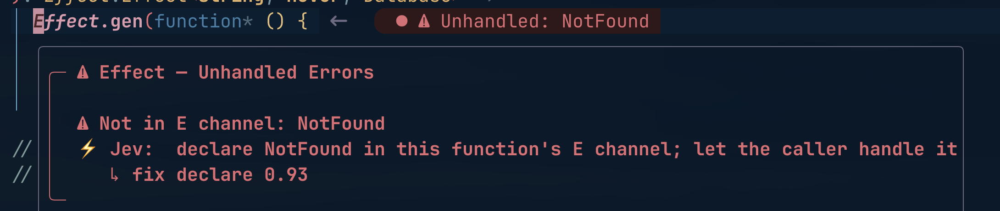
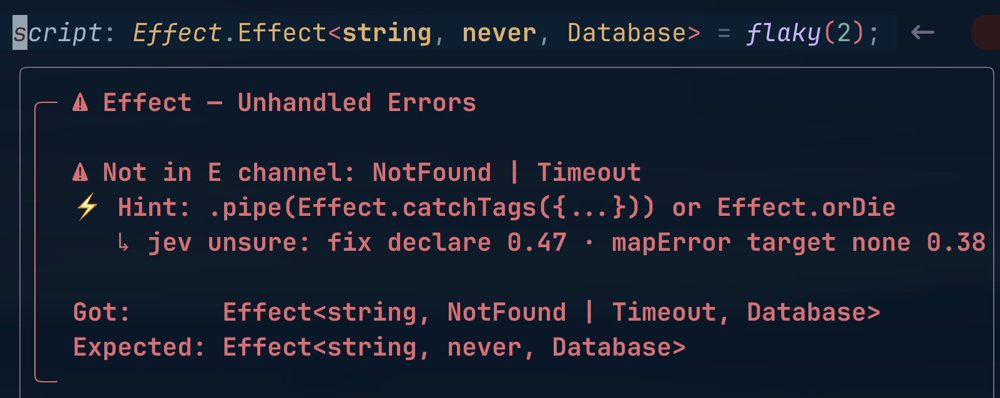

# jury.nvim

Calibrated picks for Neovim, judged by [TypeSafe Jev](https://docs.typesafe.ai).





Code enumerates the candidates. Jev picks one and says how sure it is. A
threshold decides whether you see the pick. Judgments are prefetched when
diagnostics change and cached by hash, so nothing on the hover path waits.

The first source is [effect-error-pretty.nvim](https://github.com/rashedInt32/effect-error-pretty.nvim).
Install both and its generic hints become concrete:

```
╭─ ◈ Effect — Missing Services
│
│  ◈ Forgot to provide: Greeter | Database
│  ⚡ Jev: .pipe(Effect.provide(AppLive))
│     ↳ this expression is the program boundary · 0.99
│
│  Got:      Effect<string, NotFound, Greeter | Database>
│  Expected: Effect<string, NotFound, never>
╰─
```

```
╭─ ⚠ Effect — Unhandled Errors
│
│  ⚠ Not in E channel: NotFound
│  ⚡ Jev: declare NotFound in this function's E channel; let the caller handle it
│     ↳ an inner step; its caller is better placed to decide · 0.92
╰─
```

When a channel came out as `unknown`, there is no service to name. Jev names
the definition that lost its type instead:

```
╭─ ⚠ Effect — R Not Inferred
│
│  ⚠ R is `unknown`, which is not a service
│  ⚡ Hint: something upstream is untyped — an `any`, a missing
│           annotation, or a generic that never got inferred
│  ⚡ Jev: annotate steps (src/jobs.ts:145), where R widened
│     ↳ const steps = [Effect.void, Effect.void as Effect.Effect<void, never,… · 0.81
╰─
```

The line under a concrete hint is the reason the chosen option was judged
against, not a label. Jev returns a pick and a confidence; the words are the
option's own.

When Jev is not sure, the generic hint stays and the lean is shown under it:

```
│  ⚡ Hint: .pipe(Effect.catchTags({...})) or Effect.orDie
│     ↳ jev unsure: fix declare 0.47 · mapError target none 0.38
```

## What Jev decides, and what it never does

For effect-error-pretty, four picks and one selection:

- **Which layer** to provide, from every `Layer` defined in the workspace.
- **Where** to provide it: right here, in a caller, or inside the layer. A
  `Layer` whose own `RIn` is missing gets one question, since `Layer.provide`
  inside it is the only placement.
- **Which fix** for an unhandled error: declare it, catch it, `orDie`, or
  `mapError` into one of the workspace's tagged error classes.
- **Which definition widened** a channel to `unknown`: the identifiers in
  the enclosing code are the suspects, one targeted `rg` finds their
  definitions, Jev picks the one that lost its type.
- **Which overload report** to explain on a TS2769 "No overload matches this
  call", replacing effect-error-pretty's heuristic when Jev is confident.

Everything else effect-error-pretty renders is left alone on purpose.
[docs/scope.md](docs/scope.md) lists every kind with the reason, and a test
fails when effect-error-pretty gains a kind without a decision there.

Jev never writes code. Every hint is one of effect-error-pretty's own
templates, filled with names that exist in your workspace, because Jev can
only choose from the list it was given. Below `min_confidence` nothing
changes.

## How it stays off the hover path

1. `DiagnosticChanged` fires. jury waits `debounce_ms`, and waits out insert
   mode.
2. It collects the Effect-family diagnostics of that buffer, drops the ones
   already judged, folds duplicates (tsserver and the Effect language service
   report the same line twice), and sends the rest as one request.
3. The answer lands in a cache keyed by diagnostic text plus the enclosing
   function.
4. Hover reads the cache. Miss: the generic hint, exactly as without jury.
   Hit: the concrete one.

A batch of twelve questions takes about 1 s in the background. The formatter
itself does a table lookup: 0.04 ms per box on a warm cache, 0.4 ms on a
miss. Workspace scans run in the background too, 20 to 60 ms cold across
1,700 TypeScript files. Numbers and the script that produced them are in
[evals/PERF.md](evals/PERF.md).

## Requirements

- Neovim ≥ 0.10, `curl`, `rg`
- effect-error-pretty.nvim with the hints seam (`set_hint_resolver`)
- A TypeSafe key from [console.typesafe.ai](https://console.typesafe.ai/settings/keys)

## Install

With lazy.nvim:

```lua
{
  "rashedInt32/jury.nvim",
  dependencies = { "rashedInt32/effect-error-pretty.nvim" },
  event = "LspAttach",
  opts = {},
}
```

The key comes from `api_key`, then `$TYPESAFE_API_KEY`, then
`~/.config/typesafe/key` (mode 0600). Without a key jury is silent and
effect-error-pretty behaves as if jury were not installed.

**Your diagnostics leave your machine.** The request carries the diagnostic
text, the enclosing function, the file's path relative to the cwd, whether
that code is exported, and the names and defining lines of your layers,
error classes, and the identifiers a widened channel could point at. That is
why the key is never set by default.

## Setup

```lua
require("jury").setup({
  api_key = nil,                                   -- or $TYPESAFE_API_KEY, or key_file
  key_file = vim.fn.expand("~/.config/typesafe/key"),
  model = "jev-latest",
  min_confidence = 0.6,                            -- below: lean, not hint
  debounce_ms = 500,
  context_chars = 1500,                            -- cap on enclosing-function text
  candidate_ttl = 30,                              -- seconds a workspace scan stays fresh
  notify = true,                                   -- one line per batch
  label = "Jev",                                   -- printed on the concrete line
  sources = { ["effect-error-pretty"] = true },
})
```

## Commands and events

- `:Jury status` shows sources, the last batch with every raw answer, the
  cache, and recent batches.
- `:Jury judge` judges the current buffer now.
- `:Jury clear` wipes the cache and the workspace scans.
- `User JuryJudged` fires when a batch lands, with `data.source` and
  `data.bufnr`, if you want to redraw a float.

## Writing your own source

A source turns a buffer into items, each item into questions, and answers
into a cache entry. jury handles debounce, dedupe, batching, transport, and
the cache. See `JurySource` in `lua/jury/prefetch.lua` and the
effect-error-pretty adapter in `lua/jury/sources/`. Register with
`require("jury").register_source(source)`.

## Tests

```bash
tests/run.sh
```

Headless nvim with a fake transport, against a sibling
effect-error-pretty.nvim checkout or `$EFFECT_ERROR_PRETTY_PATH`.

## Evals

`evals/` judges real tsc and language-service output against the live API
and records accuracy, confidence and latency per family in
`evals/RESULTS.md`. `evals/perf.lua` times every path jury adds to the
editor. See [evals/README.md](evals/README.md).

## License

MIT
